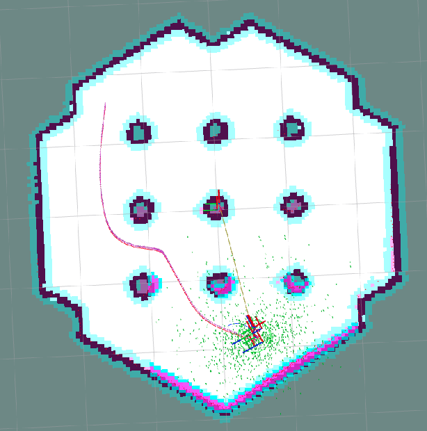

# nav2_ompl_plugins
## nav2_ompl_planner
### Run the planner
1. Clone the repository and build in your colcon workspace:
````
cd colcon_ws
colcon build --packages-select nav2_informed_rrt_star_planner --symlink-install
source install/setup.bash
````

2. Add the planner in your nav2 configuration
Replace the following lines in your nav2 config file:
````
planner_server:
  ros__parameters:
    expected_planner_frequency: 1.0
    planner_plugins: ["GridBased"]
    GridBased:
      plugin: "nav2_ompl_planner/InformedRRTStarPlanner"
      solving_time_s: 1.0
````

### Visualization
<p align="center">

</p>
